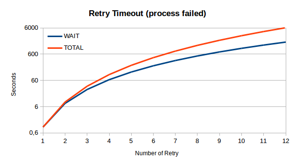
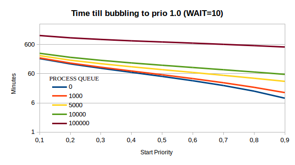
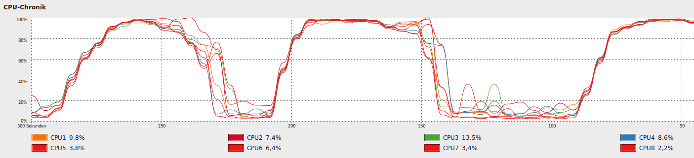

Package: alinex-spawn
=================================================

[![Build Status] (https://travis-ci.org/alinex/node-spawn.svg?branch=master)](https://travis-ci.org/alinex/node-spawn)
[![Dependency Status] (https://gemnasium.com/alinex/node-spawn.png)](https://gemnasium.com/alinex/node-spawn)

This is an object oriented implementation around the core `process.spawn`
command. It's benefits are:

- automatic error control
- automatic retry in case of error
- automatic delaying in case of high server load
- completely adjustable
- use priorities (also on OS level)

It is one of the modules of the [Alinex Universe](http://alinex.github.io/node-alinex)
following the code standards defined there.


Install
-------------------------------------------------

The easiest way is to let npm add the module directly:

``` sh
npm install alinex-spawn --save
```

[](https://nodei.co/npm/alinex-spawn/)


Usage
-------------------------------------------------
You may connect to the process using a callback method on the `run()` call or
use the events.

First you have to load the class package.

``` coffee
Spawn = require 'alinex-spawn'
Spawn.init() # optional loading spawn... config
```

You may also load a specific configuration like:

``` coffee
Spawn.init 'spawn'
```

Now you may setup an external process like:

``` coffee
proc = new Spawn
  cmd: 'date'
```

You may also change the configuration afterwards like:

``` coffee
proc.config.cmd = 'date'
```

Now you have multiple ways to work and control your process.

### Run with Callback

To run this simple process call the run-method:

``` coffee
proc.run (err, stdout, stderr, code) ->
  # work with the results
```

After the process has completed its task the callback will be called with the
most used data. But you may access all details through the `proc` object.

### Run using Events

With events you can monitor what's going on while the process works.

``` coffee
proc.run()

stdout = ''
proc.on 'stdout', (data) ->
  stdout += data
proc.on 'done', ->
  # analyse the results
```

### Check for Success

The class will automatically check for success (based on exit code) and run some
retries. A message containing the error code and possibly some information from
the output will be generated.

You may give a different check method in the configuration which will be used to
check whether the process succeeded and return an Error or undefined:

``` coffee
proc.config.check = (proc) ->
  return new Error "Got exit code of #{proc.code}" if proc.code
```

You may also make some ḱind of filter which specifies some known errors:

``` coffee
proc.config.check = (proc) ->
  return if proc.stdout.match /Error: Unknown file type/
  # else use general check
  return proc.constructor.check proc
```

This check will automatically be called on normal process close. If you want to
know if it got an error you can use the event or callback value or check for:

``` coffee
if proc.error
  # something went wrong
```

If a check went wrong the process will be scheduled for retry after the following
time (time=retry ^ 3):

| Retry | Timeout | Total |
|-------|---------|-------|
|   1   |      1s |    1s |
|   2   |      8s |    9s |
|   3   |     27s |   36s |
|   4   |     64s |  100s |
|   5   |      2m |    4m |
|   6   |      4m |    7m |
|   7   |      6m |   13m |
|   8   |      9m |   22m |
|   9   |     12m |   34m |
|  10   |     17m |   50m |
|  11   |     22m |   73m |
|  12   |     29m |  101m |



On each retry the priority will go down giving in favor for other jobs which
didn't failed.

To disable retrying use the configuration:

``` coffee
proc.config.retry = 0
```

### Use load handling and priorities

You don't have to do anything for load handling, it comes out of the box but you
may customize it for your machine in the configuration file.

You may also add specific settings dynamically after loading

``` coffee
# This maybe changed per machine.
Spawn.LOAD = 1   # limit system load (limit will be between 0.8*LOAD and 4*LOAD)
Spawn.WAIT = 10  # wait between WAIT seconds and WAIT minutes + queue size
```

See the detailed explanation below to see what each value means. Also you may
specify what the limit of processes for each start period will be.

``` coffee
# The weight which can be started per each start period
Spawn.WEIGHTTIME = 10   # time for each period in seconds
Spawn.WEIGHTLIMIT = 10  # size of load allowed for each period
```

If you use non standard commands you may help the system balancing the start by
giving each command a specific weight. Some default commands are already defined.

``` coffee
# Specific weights for each command
Spawn.WEIGHT.SITMarkAVMulticontainerFFmpeg = 500
```

A weight of 1 means that it normally may be started 1/sec.
If you have a setting above the WEIGHTLIMIT it is started only as first
of a time period. Best way is to have the weights < WEIGHTLIMIT to ensure
proper priority handling.

If you want to disable the loadhandling you may set the priority of a process
or maybe even the default priority above 1. But keep in mind that this can
lead to a system crash. A Better Way is to set the `LOAD` setting to a high value
of maybe 5 (will limit the system load at about 20 per cpu).

### Retry on failure

If a command got an error it may be called again. How often is specified in it's
configuration `retry` or from the default `retry` setting in the class. The next
run will start at the quadrature time in seconds (1, 4, 9, 16, 25, ... seconds).

After the defined number of retries the spawn will return with an error.

If the problem is the process limit it will automatically rerun after 1 second
without counting that.


Load handling
-------------------------------------------------
Starting lots and heavy processes can lead to a fully overloaded systems which
won't really do anything.

To don't get into such a situation the spawn module will check the system and
wait for creating the new system processes till the system can handle it. All
this have to be done prioritized.

### Load checking

Therefore the system will check the current system load. To get a comparable
value the load as displayed in the `top` command will be harmonized by dividing
it through the number of cpu cores.

``` coffee
load = short-load / num-cpus
```

So a load of 1 meaning every core has to do enough in the moment, but a system
may also have more things to do (meaning they are in the system's queue) as the
ones just being processed.

| LOAD | prio 0..1  | quad-core load |     comment for setting    |
|------|------------|----------------|----------------------------|
|  0.2 | 0.2 -  0.8 |     0.6 -  3.2 | neither implies the system |
|  0.5 | 0.4 -  2.0 |     1.6 - 10.0 | minor priority service     |
|  0.8 | 0.6 -  3.2 |     2.6 - 12.8 | customer system            |
|   1  | 0.8 -  4.0 |     3.6 - 20.0 | best performance (default) |
|  1.5 | 1.2 -  6.0 |     4.8 - 24.0 | if peaks are short         |
|   2  | 1.6 -  8.0 |     6.4 - 32.0 | fast but may overload      |
|   5  | 4.0 - 20.0 |    16.0 - 80.0 | maintenance services only  |

As you see the correct setting depends on what purpose the machine has, what
else runs on that machine and the priority of the service itself.


Like the above graph shows the spawn module has a load `LIMIT` set per each
machine. This specifies up to which harmonized load a process can be started.
The graph shows how this is implemented for different priorities.

The default setting for a machine in the backoffice which should run as much
processes as possible should be 1.0 while you may use lower values if the
system should keep fast and responsible for other things, too.

### Sleep Interval

If an process can't be started because the system load is to high and maybe his
priority to low, it will be queued and rechecked after a timeout again. Because
higher prioritized processes can start earlier they will be checked more
frequently than lower priority processes.


The graph shows how long the interval till the next check will be for different
`WAIT` settings. This value will set the minimum wait time in seconds and the
maximum wait time in minutes.

But to decrease the load the system will get from rechecking thousands of waiting
processes the interval also will be 10ms longer for each already waiting process.
This gives the system enough performance to also do the real work while rechecking
the load.

### Priority Level up

To get processes which are waiting long be processed first their priority will
slowly increase and go against the highest priority of 1.0.


This causes a reduced waiting time for the next chack and higher load limits.



This diagram shows how long it will take for a specific process call to become
a highest priority process while waiting in the queue with different queue lengths.

### Start limit

Because the load values will take some time to show the new system load based on
just started processes the number of processes to start each second are limited.
The system has a limit and time period set (see above) which defines how many
processes are allowed to be started.

As an additional benefit smaller processes may be called earlier because their
weight is low and can be added to the already high weight.

### OS Priorities

The process priorities will not only work for the start queue but also on the
operating system if already running. Therefore the nice-value of each process is
set appropriate to it's priority. That allows the operating system to give the
processes different amount of cpu time. The range goes from 5% to 200% of the
normal system process (nice=0).

### Real life load

The following chart shows a test measurement on a server while running a high
load of audio conversion jobs.



This shows how the system will react based on the load. A high CPU usage over
longer time will cause a high load (but also from high IO). So no new processes
are started. The running ones end and the load of the system goes slowly down
while the current CPU usage is already down. Then the load is low new processes
are started and the CPU usage will directly jump up.

But the whole time the system keeps running and being responsive.


API
-------------------------------------------------

### Class setup

- `ìnit(config, cb);` - initialize the spawn class

### Class variables

- `config` (object) - configuration settings for the machine
- `configsearch` - list of paths to search for config files
- `time` (integer) - current time period
- `weight` (float) - already used weight in this time period
- `queue` (integer) - number of processes in queue
- `checkExitCode()` - predefined function to use for instances


### Instantiate

    new Spawn(config);

This will create a new process to be run later. You may define it directly on
instantiation or through it's `config` property afterwards.
A spawn instance may also be reused to run again or run with some modification
again.

See the `config` property below for what to be configured here.

### Methods

- `run(cb)` - to start a preconfigured process

### Properties

- `config` - setup for the process
  - name (string) - descriptive name (optional)
  - cmd (string) - the command to run
  - args (array) - all arguments to be given to the command
  - cwd (string) - current working directory
  - env (object) - environment key-value pairs
  - uid (integer) - user identity of the process
  - gid (integer) - group identity of the process
  - check (function) - to check whether process succeeded
  - balance (boolean) - set to true to use server load balancing
  - priority (float) - between 0..1
  - retry (integer) - number of possible retries
  - stdout - function to get stdout line by line
  - stderr - function to get stderr line by line

__Runtime data__

- `name` - descriptive name of the process
- `pid` - process pid which has been given
- `start` - date when the process started
- `end` - date when the process finished
- `code` - return code of the process
- `stdout` - output of the process
- `stderr` - error output of the process
- `error` - Error object if one occurred
- `retrycount` (integer) - number of retries

### Events

- `fail` (object) - if an error occurred
- `stdout` (string) - if a line is outputted
- `stderr` (string) - if a error line is outputted
- `done` (integer) - if the process finished giving exit code
- `wait` (integer) - if the process is paused given seconds
- `retry` (integer) - if the process will be retried after given seconds


Problems
-------------------------------------------------
If you get the message that too much event listeners are set on the config
class and this may be a memory leak. You started to much processes while the
config is not fully loaded. Better use the `Spawn.init()` method with a
callback to wait for the initialization before starting.


License
-------------------------------------------------

Copyright 2014 Alexander Schilling

Licensed under the Apache License, Version 2.0 (the "License");
you may not use this file except in compliance with the License.
You may obtain a copy of the License at

>  <http://www.apache.org/licenses/LICENSE-2.0>

Unless required by applicable law or agreed to in writing, software
distributed under the License is distributed on an "AS IS" BASIS,
WITHOUT WARRANTIES OR CONDITIONS OF ANY KIND, either express or implied.
See the License for the specific language governing permissions and
limitations under the License.
